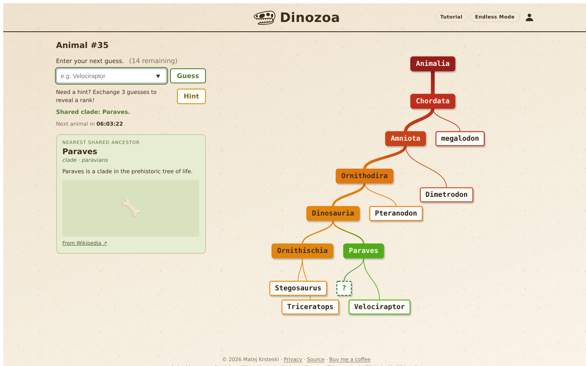
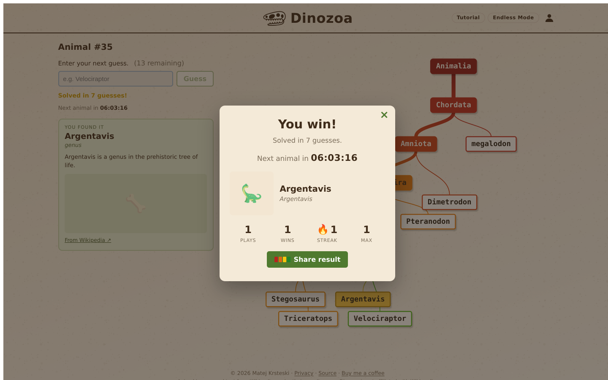
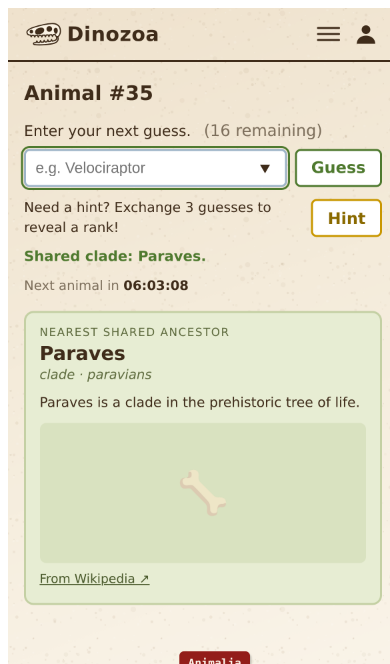

# Dinozoa

**A daily guessing game where wrong answers teach you the tree of life.**

[**Play it →**](https://dinozoa.com) · [Privacy](https://dinozoa.com/privacy.html)



One hidden prehistoric animal a day, the same one for every player. Rather than telling
you a guess is simply wrong, Dinozoa places it on a real taxonomic tree and shows how
closely related it is to the answer. Guess a shark and you share almost nothing. Guess
Stegosaurus and you are at least inside Dinosauria, so the colour warms. The tree grows
with every guess, red for distant through to green for nearly there, with a `?` marking
where the answer hides.

Built as a university project for *Интернет програмирање на клиентска страна* at FINKI.

## What is interesting about it

**The whole game runs on one algorithm.** Every guess is scored by finding its lowest
common ancestor with the answer in a 627-node taxonomy, then measuring how deep that
shared ancestor sits. Colour, warmth and the tree diagram are all consequences of that
single number.

**The answer pool was rebuilt from measured data, not intuition.** The first version was
unplayable because I had chosen the animals myself and had lost all sense of which ones a
normal person recognises. I surveyed 80 people, discovered the median player recognised
fewer than half of them, and rebuilt the pool from the results. [The full story is
below](#the-answer-pool).

**No framework and no backend.** TypeScript, Vite and the native DOM and SVG APIs, with
zero runtime dependencies. Every player's browser independently computes the same daily
answer from a seeded shuffle, so there is no server to disagree with.

| | |
|---|---|
|  |  |

## Running the project

```bash
npm install
npm run dev      # development server
npm run build    # type-check and build into dist/
npm test         # run the test suites
npm run preview  # serve the production build
```

A prebuilt `dist/` folder is included, so the project can also be opened directly through
any static file server without installing dependencies.

## Technology

TypeScript and Vite, with no runtime dependencies. The interface is built with the native
DOM and SVG APIs rather than a framework.

jQuery is covered in the course but is not used here. Its two original purposes were
smoothing over browser differences and shortening verbose DOM calls, and both are handled
by the standard library now: `document.querySelector` replaces `$()`, `fetch` replaces
`$.ajax`, and `classList` replaces `addClass`. The equivalent native APIs are used
throughout.

## Project structure

```
build_db.py                         generates the taxonomy JSON
public/data/dinosaur-database.json  627 nodes, 472 guessable animals, 129 possible answers
tools/rank_notability.py            measures Wikipedia pageviews per taxon
src/
  main.ts               application setup and event wiring
  endlessMode.ts        the Endless game loop
  data/loadTree.ts      loads the JSON and builds the id, parent and name lookups
  game/lca.ts           lowest common ancestor and closeness calculation
  game/dailyAnimal.ts   deterministic answer selection for a given date
  game/gameState.ts     guess handling, hints, win and lose conditions
  storage/stats.ts      localStorage persistence for stats and saved games
  ui/render.ts          info card, status line, modals, stats panel
  ui/treeView.ts        SVG tree layout and animation
  ui/wiki.ts            Wikipedia image and description lookup
rules_test.ts           game rule tests
stats_test.ts           storage and streak tests
wiki_test.ts            image selection and accuracy tests
```

## Rules

Twenty guesses per day. A hint costs three guesses and reveals the next taxonomic rank
down the answer's lineage; hints are offered only while more than three guesses remain, so
taking one can never end the game by itself. Winning or running out opens a summary with
the animal, a photograph, and the player's statistics.

## The lowest common ancestor

The game is built on one algorithm. Given a guess and the answer, it finds the deepest node
in the taxonomy that is an ancestor of both.

```
findLCA(answer, guess):
    collect every ancestor of the answer into a Set
    walk upward from the guess
    return the first node already in the Set
```

The depth of that shared ancestor is the score. A guess sharing only the kingdom is as far
away as possible; a guess sharing the family is nearly correct. Closeness is expressed as
the shared ancestor's depth divided by the depth of the answer's parent, which reserves the
top of the range for guesses that are genuine siblings of the answer.

With Triceratops as the answer, at depth 14:

| Guess | Shared ancestor | Rank | Depth | Closeness |
|---|---|---|---|---|
| megalodon | Chordata | phylum | 1 | 0.07 |
| Stegosaurus | Ornithischia | clade | 9 | 0.64 |
| Styracosaurus | Ceratopsidae | family | 13 | 0.93 |
| Triceratops | Triceratops | genus | 14 | 1.00 |

Colour comes from a four-stop gradient at positions 0.00, 0.35, 0.68 and 1.00, running red,
orange, yellow, green. The stops are unevenly spaced so that green is reserved for genuinely
close guesses rather than arriving halfway through the range. Because colour depends only on
closeness and has no memory, a guess that moves back out of the family returns down the
gradient on its own.

## Selecting the daily animal

There is no server, so every browser has to arrive at the same animal independently. The
date is used as the seed for a Mulberry32 pseudo-random generator, which drives a
Fisher-Yates shuffle of the answer pool. Identical seed, identical order, on every machine.

Day numbers are counted in UTC from 1 August 2026. An earlier version used the device's
local calendar, which meant changing the system clock produced the next day's answer and
crossing a time zone could break a streak.

The pool holds 129 animals, so answers must repeat over a year. Rather than repeating at
random, the shuffled pool is dealt through completely before being reshuffled with a new
seed. No answer can recur until all 129 have been used, and each pass through the pool is
in a different order.

## Drawing the tree

`treeView.ts` is the largest module and solves three problems at once.

**Fitting.** The database has 627 nodes, but a game with five guesses should not draw 627
boxes. The renderer builds the induced subtree connecting the root, the guesses and the
answer, keeping only nodes where branches actually diverge. A full twenty-guess game draws
around forty boxes. The SVG `viewBox` is then set to the drawing's real bounding box with
`preserveAspectRatio="xMidYMid meet"`, so the browser scales the diagram to the available
space rather than the layout being tuned by hand.

**Label collisions.** Spacing is derived from measured text widths using a canvas
`measureText` call. Leaves alternate across up to four vertical tiers, and a final
relaxation pass separates any pair of labels that still overlap. This was verified by
simulating 300 random games and counting overlapping bounding boxes rather than by
inspecting screenshots; an earlier version looked correct in a screenshot while producing
around six overlaps per game.

**Small screens.** Fitting everything into the pane guarantees no scrollbar, which is
correct on a desktop and wrong on a phone: thirty boxes squeezed into a 358 pixel pane
produced 6.2 pixel labels. The renderer now measures what the fitted text size would be, and
if it falls below eleven pixels it stops fitting, renders at the smallest scale that clears
that floor, and allows the pane to scroll. Layout was checked across nine viewport widths
from 320 to 1440 pixels.

**Animation.** Each branch is an SVG `<path>` whose dash pattern is as long as the path
itself, with the dash offset out of view. A SMIL `<animate>` returns the offset to zero, so
the line appears to draw itself downward from the parent, and the box at the end fades in as
its branch arrives. Branches at the same depth begin together. The SVG timeline is reset
with `setCurrentTime(0)` before each render, because SMIL begin times are absolute and
without the reset only the first render after page load would animate correctly. Per-level
delay is compressed when a full replay would exceed 4.2 seconds, since this tree reaches
nineteen levels. `prefers-reduced-motion` is respected.

## The answer pool
<a id="the-answer-pool"></a>

Only leaves marked `"answer": true` can be the daily answer. All 472 leaves remain
guessable, so obscure animals are still useful for narrowing down the search.

The first version of the pool contained 372 animals. It was built on the rule that
everything outside a curated list of obscure taxa was answer-eligible, which guaranteed a
full year without repeats. That satisfied the arithmetic but made the game unfair, because
most days produced an animal almost nobody recognises.

To fix this properly I ran a survey. Eighty respondents first stated how familiar they were
with dinosaurs, then marked every name in the pool they had never heard of. Among the target
group, players who had a childhood interest in dinosaurs or still read about them casually,
the median respondent recognised fewer than half of the animals then in the pool.

The pool was rebuilt from that data. An animal qualifies if at least 45 percent of the
target group recognised it, followed by a manual review pass. Three animals were excluded on
other grounds: *Thylacinus* became extinct in 1936, and *Ursus* and *Bison* are living
genera, so none belong in a game about prehistoric life regardless of how well they scored.
All three remain guessable.

`tools/rank_notability.py` provides an independent check by measuring English Wikipedia
pageviews for every taxon, and can regenerate the pool from measured readership.

## Alternate names

Players type `trex`, not `Tyrannosaurus`. The database carries 270 alternate names across
195 genera, drawn from ARK: Survival Evolved community shorthand, the Jurassic Park films,
and the common names on museum labels. `trex`, `raptor`, `dilo`, `trike`, `dodo`,
`sabertooth` and `megalodon` all resolve to the correct genus.

Ambiguous abbreviations are deliberately excluded. `deino` could refer to Deinonychus,
Deinosuchus, Deinotherium or Deinocheirus, and resolving it arbitrarily would be worse than
not matching at all. `build_db.py` fails the build if any alternate name is claimed by two
genera.

## Storage

There is no account system and no server. Statistics live in `localStorage` under
`dinozoa.stats`, with one additional key per day holding that day's guesses and hints so
that refreshing mid-game restores the position.

localStorage was chosen over cookies because it is not transmitted with every request, has
considerably more space, and does not expire. The trade-off is that statistics are tied to a
single browser on a single device.

Every read and write is wrapped in try/catch, so private browsing modes that block storage
degrade to a working game that does not remember anything.

## Endless mode

Available at `?endless`. Random animals in sequence, ten guesses and three free hints each.
There are no lives: failing an animal moves straight to the next one rather than ending the
run. Score, rounds and accuracy are tracked in separate storage and never affect the daily
streak.

## Wikipedia integration

The information card fetches a description and image from the Wikipedia REST API.

Clades and individual animals are treated differently. For a clade the article's lead image
is used, since it is usually a composite plate showing several members of the group. For an
individual animal the lead image is frequently a mounted skeleton, which shows the player
nothing about the living creature, so the module retrieves every image on the page and
scores the filenames to find a life restoration. Names containing `restoration`,
`reconstruction` or an artist credit score positively; `skeleton`, `holotype`,
`size_comparison` and similar score negatively. If nothing scores well the lead image is
used, so the fallback is the original behaviour.

## Tests

```
npm test
```

Three suites run against the real modules in Node, with `fetch` stubbed to read the JSON
from disk.

| Suite | Covers | Assertions |
|---|---|---|
| `rules_test.ts` | guess limit, hint cost, win and lose, save and restore | 22 |
| `stats_test.ts` | persistence, streak arithmetic, reset, storage failure | 19 |
| `wiki_test.ts` | image selection scoring, accuracy label | 38 |

`npm run build` additionally type-checks the project under a strict `tsconfig` with
`noUnusedLocals`, `noUnusedParameters` and `verbatimModuleSyntax`, and must complete with no
errors.

## Licence

The **source code** is licensed under the **GNU Affero General Public License v3.0**
(`LICENSE`). It may be read, run, modified and redistributed; anyone who runs a modified
version as a public service must publish their source under the same terms.

The **data** is licensed separately under **CC BY-NC-SA 4.0** (`LICENSE-DATA.md`). This
covers the taxonomic tree, the answer pool and the alternate-name tables, which took
considerably more work than the code that renders them.

Animal images and descriptions come from Wikipedia at runtime and remain under their own
licences, most commonly CC BY-SA. The game credits the image author where the Wikimedia
API supplies one.

## Deployment

`base` is `'./'` in `vite.config.ts` and every asset reference is relative, so the same
build runs from a domain root or from a subfolder such as `username.github.io/dinozoa/`.

Open Graph and Twitter image tags must be absolute URLs or link previews render blank, so
the site URL is supplied at build time. `.env.production` holds `VITE_SITE_URL`, and Vite
substitutes it into `index.html` through the `%VITE_SITE_URL%` placeholder. Changing the
domain means editing that file, `public/robots.txt` and `public/sitemap.xml`.

`public/manifest.json` and the PNG icons make the game installable, so it opens without
browser chrome when added to a phone home screen.

## Caching the Wikipedia data

```bash
python3 tools/cache_wiki.py --answers-only
```

Writes `public/data/wiki-cache.json`: the description, image URL and image author for each
taxon. When the file is present the info card renders without any network request, which
removes the two round trips that were the slowest part of each guess. It is optional; if the
file is missing or a taxon is not in it, the game falls back to fetching live.

### When an image is still wrong

Filename scoring cannot see the picture, only its name, so it will never be
perfect. A tail-muscle diagram, a film still and a fossil trackway were all
genuinely captioned with the right animal's name.

Three defences, in the order the game checks them:

1. **`public/data/image-overrides.json`** — hand-picked, checked first, never
   regenerated. Open the Wikipedia page, pick an image, paste its address under
   the scientific name. That is the permanent fix for any individual animal.
2. **`public/data/wiki-cache.json`** — the pre-baked results.
3. **Live scoring**, which must find a real "life restoration" signal worth at
   least `MIN_ACCEPT`. Anything ambiguous falls back to the article's own lead
   image, on the grounds that a Wikipedia editor chose it deliberately and the
   heuristic did not.

Run it after `build_db.py`, and again whenever the answer pool changes. Set `USER_AGENT` at
the top of the script to real contact details first, as Wikimedia asks scripts to identify
themselves.

## Regenerating the database

```bash
python3 build_db.py
```

The JSON is generated rather than edited by hand. `build_db.py` holds the internal skeleton
of the tree, the genus lists, the `SURVEY_POOL` of answer-eligible animals and the alternate
name table. Running it writes directly to `public/data/` and reports the node counts, which
source the answer pool came from, and whether any alternate name is ambiguous.
